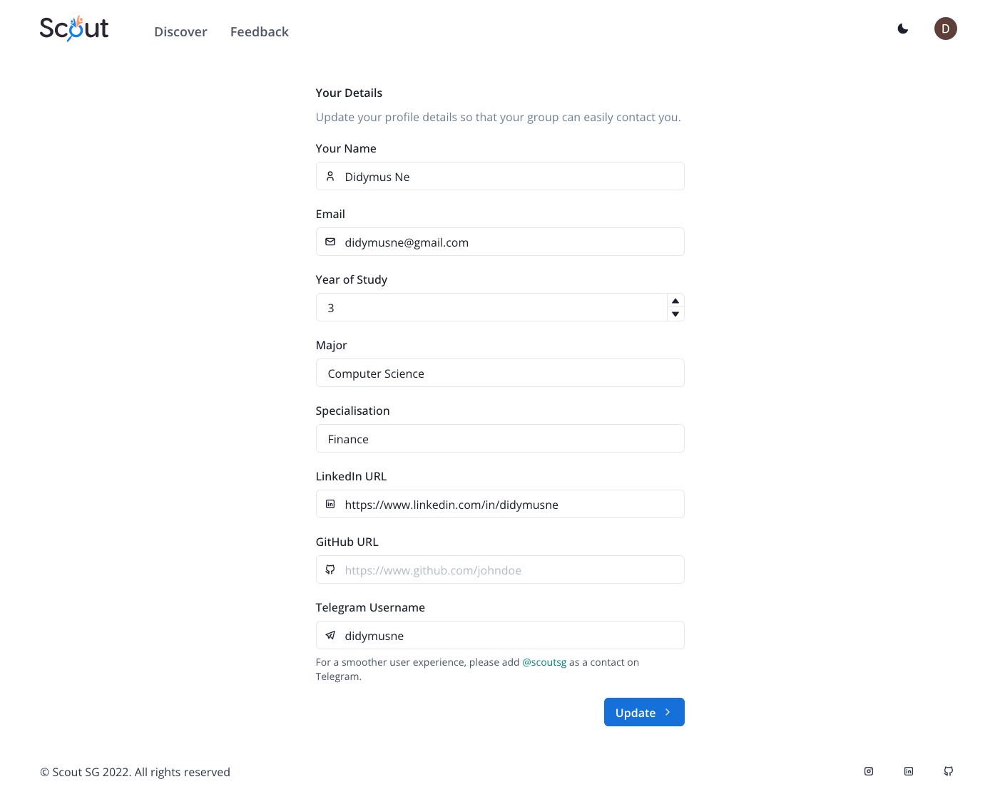

<p align="center"></p>
<h3 align='center'>Build your dream team.</h3>
<p align='center'>AY22/23 CS3216 Final Project</p>
<p align="center"><a href="https://scoutsg.vercel.app/">Give it a try now!</a></p>


## Table of Contents

1. [Overview](#overview)
2. [Team Members](#team-members)
3. [Submission](#submission)
4. [User Guide](#user-guide)
5. [Developer Guide](#developer-guide)
6. [Tech Stack](#tech-stack)


## Overview

Scout is a responsive web app with a mission to help university students find and form teams rapidly for undergraduate competitions. 

On Scout, users can discover competitions, lead or join a team, invite friends to their team, and share their team's openings for others. 

Students generally face difficulties finding suitable teammates to join competitions - some are solo participants, while others may have a partial group but face difficulties in completing the team. Scout is here to reduce this problem as it provides a platform for students to discover teams or teammates who complement their personalities and skill sets, so that they can achieve their goals for the competition

Feel free to give it a try at: [https://scoutsg.vercel.app/](https://scoutsg.vercel.app/)

## Team Members

| Name                | Contributions                                    |
| ------------------- | ------------------------------------------------ |
| Didymus Ne          | Full Stack Developer, Marketing, User Interviews |
| Keith Gan           | Full Stack Developer, Product Designer           |
| Lee Yong Ler        | Backend Developer, Marketing                     |
| Lye Wen Jun         | Full Stack Developer, User Interviews            |

## Submission

The following files are in the `root` folder:
- [group-4-poster.pdf](/group-4-poster.pdf)
- [group-4-final-project-report.pdf](/group-4-final-project-report.pdf)

## User Guide

Watch our product demo [here](https://youtu.be/PvrLJjGGPpw)

1. Discover Competitions

Find competitions of your interest. 

<p align="center"></p>

2. View Competition Details

<p align="center"></p>

3. Lead a team

<p align="center"></p>

4. Ask Effective Questions

<p align="center"></p>

5. Set Up Automatic Telegram Group

<p align="center">
  
  
</p>

6. Share team details

<p align="center"></p>

7. Directly invite peers to team

<p align="center"></p>

8. Request to join team

<p align="center"></p>

9. View personal Profile, Groups, and Requests

<p align="center">
  
  
  
</p>

10. Light / Dark Mode
Scout is available in light and dark mode.

<p align="center">
  
  
</p>

## Developer Guide

To run this application locally, first clone this repository. 

```
git clone https://github.com/cs3216/2022-final-project-2022-fp-group-4.git
```

Then go to the `scout` folder and run:

```
npm run dev
```

## Tech Stack

Scout is built with NextJS, Prisma, Typescript, Chakra UI and the Telegram API.
